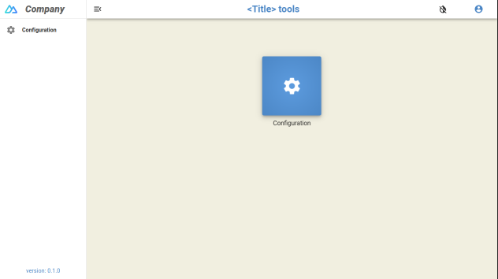

# Nuxt 3 template

This is a nuxt 3 typescript template with:
- sidebar
- toolbar
- snackbars queue notification
- role management
- eslint / prettier configuration



## Frameworks:

- Nuxt 3
- Vue.js 3
- Vuetify 3
- Pinia

## Todo:

- [ ] Add backend support
- [ ] Add users roles management in config
- [ ] ...

## Setup

Make sure to install the dependencies:

```bash
# npm
npm install

# pnpm
pnpm install

# yarn
yarn install

# bun
bun install
```

## Development Server

Start the development server on `http://localhost:8000`:

```bash
# npm
npm run dev

# pnpm
pnpm run dev

# yarn
yarn dev

# bun
bun run dev
```

## Production

Build the application for production:

```bash
# npm
npm run build

# pnpm
pnpm run build

# yarn
yarn build

# bun
bun run build
```

Locally preview production build:

```bash
# npm
npm run preview

# pnpm
pnpm run preview

# yarn
yarn preview

# bun
bun run preview
```

Check out the [deployment documentation](https://nuxt.com/docs/getting-started/deployment) for more information.
